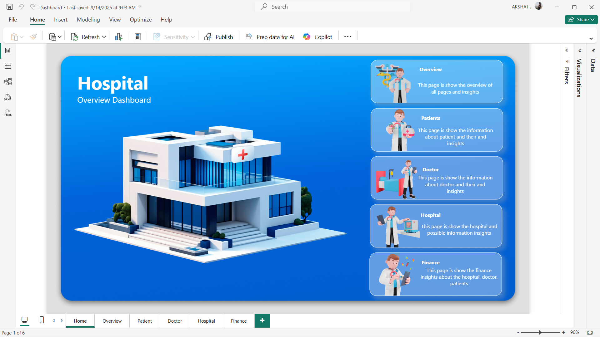
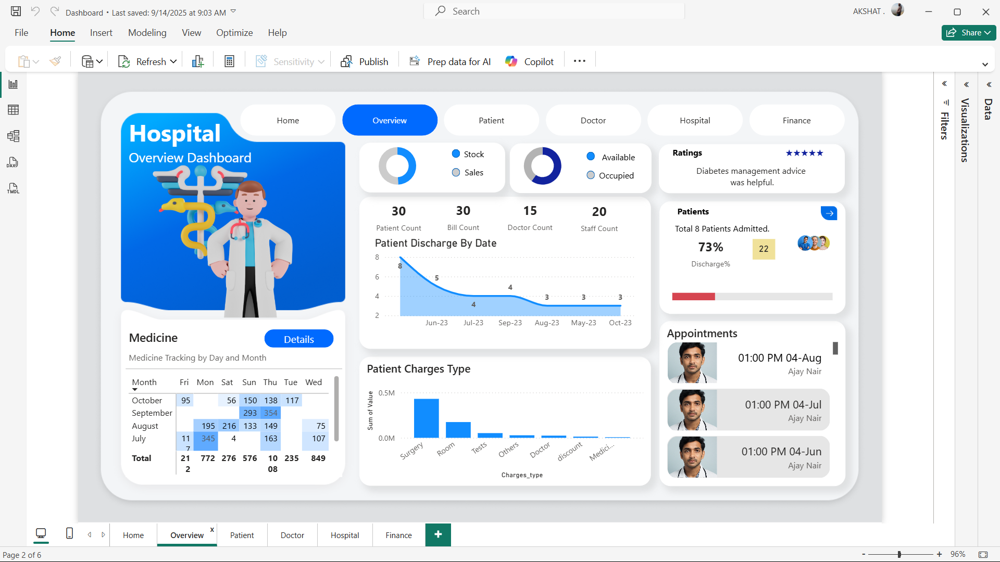
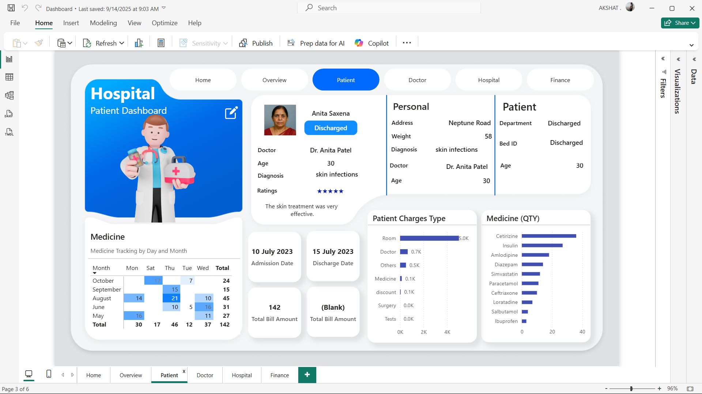
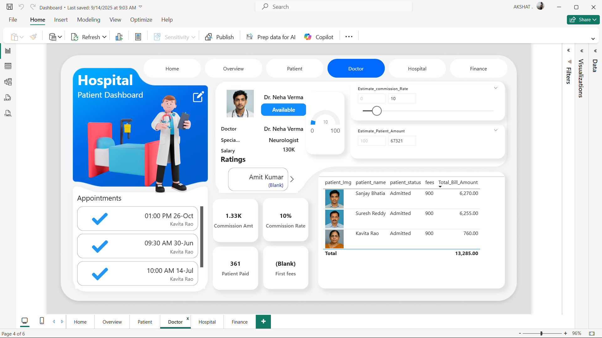
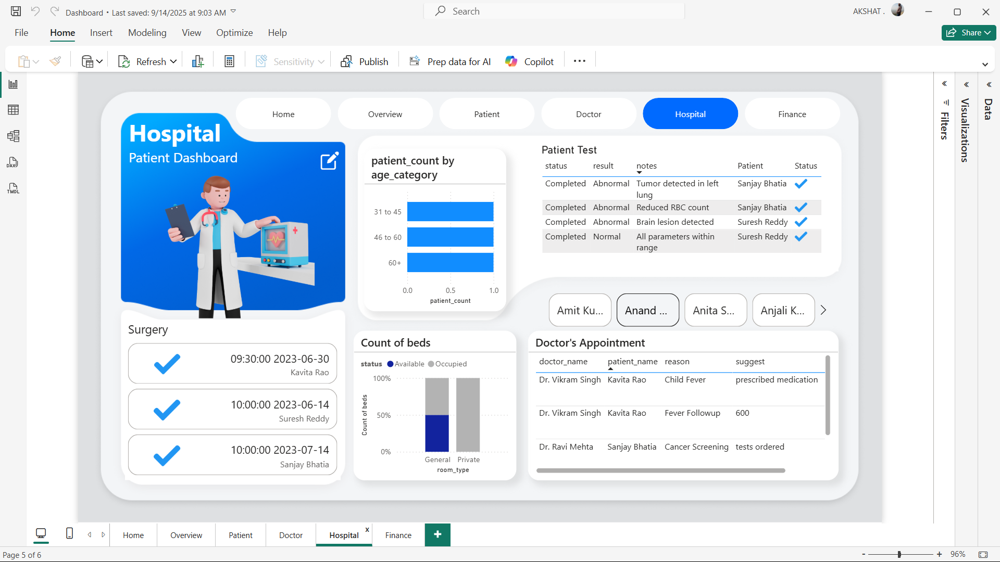
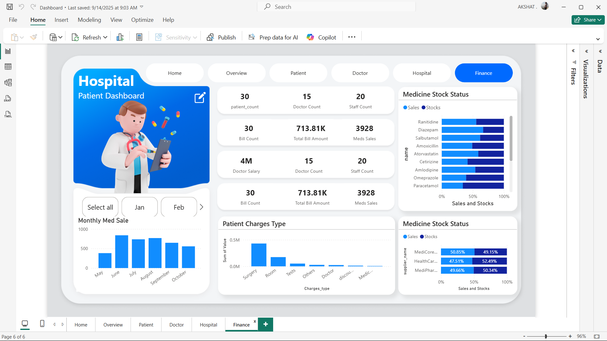

# Hospital Patient Dashboard

A comprehensive healthcare data visualization dashboard built for hospital management and patient tracking. This interactive dashboard provides real-time insights into patient care, medical staff performance, financial metrics, and operational efficiency.

## 🏥 Features

### Multi-Page Dashboard System
- **Home**: Central navigation hub with overview of all dashboard sections
- **Overview**: High-level hospital metrics and key performance indicators
- **Patient**: Detailed patient information, medical records, and treatment tracking
- **Doctor**: Staff management, appointments, and performance metrics
- **Hospital**: Facility operations, bed management, and administrative data
- **Finance**: Financial analytics, billing, and revenue tracking

### Key Functionalities

#### 📊 Patient Management
- Patient registration and profile management
- Medical history tracking and test results
- Discharge planning and status monitoring
- Age-based patient categorization and analytics
- Real-time patient count and bed occupancy

#### 👩‍⚕️ Medical Staff Tracking
- Doctor profiles with specialization details (Neurologist, etc.)
- Appointment scheduling and management
- Staff performance ratings and feedback
- Salary and commission tracking ($130K+ salaries)
- Availability status monitoring

#### 💊 Medicine & Inventory
- Medicine stock status and inventory management
- Sales vs stock comparison charts
- Pharmaceutical tracking (Ranitidine, Diazepam, Salbutamol, etc.)
- Supply chain analytics
- Medicare/HealthCare/MediPharm distribution analysis

#### 💰 Financial Analytics
- Patient billing and charge tracking
- Revenue analysis by service type (Surgery, Room, Tests, etc.)
- Commission and payment processing
- Total bill amounts and financial summaries
- Monthly medication sales tracking

## 📊 Dashboard Components

### Interactive Visualizations
- **Bar Charts**: Medicine stock levels, patient demographics
- **Line Charts**: Patient discharge trends, monthly sales data
- **Donut Charts**: Bed occupancy, staff availability
- **Data Tables**: Patient records, appointment schedules, billing information
- **KPI Cards**: Key metrics like patient count (30), doctor count (15), staff count (20)

### Data Insights
- Patient count by age category (31-45, 46-60, 60+)
- Bed availability tracking (Available vs Occupied)
- Test result monitoring (Completed, Normal, Abnormal status)
- Medicine quantity tracking with sales analytics
- Financial performance indicators

## 🖥️ Screenshots

### Home Dashboard
*Central navigation with quick access to all sections*

### Doctor Dashboard
*Staff information including Dr. Neha Verma (Neurologist) with appointment tracking and ratings*

### Finance Dashboard
*Revenue analytics showing $713.81K total bill amount and medicine sales data*

### Overview Dashboard
*Hospital overview with 3D building visualization and section descriptions*

### Hospital Dashboard
*Operational data including surgery schedules, patient tests, and bed management*

### Patient Dashboard
*Individual patient profiles like Anita Saxena with personal details, treatment history, and billing*

## 🚀 Getting Started

### Prerequisites
- Power BI Desktop or Power BI Service access
- Hospital management system data source
- Appropriate permissions for healthcare data access

### Installation
1. Clone this repository
```bash
git clone https://github.com/yourusername/hospital-patient-dashboard.git
```

2. Open the dashboard file in Power BI Desktop

3. Connect to your hospital data sources

4. Refresh data connections and publish to Power BI Service

## 📊 Data Sources

This dashboard integrates data from:
- Patient management systems
- Electronic health records (EHR)
- Staff scheduling systems
- Inventory management systems
- Financial and billing systems
- Laboratory information systems

## 🔒 Security & Compliance

- Follows healthcare data privacy regulations
- Implements row-level security for patient data
- Ensures HIPAA compliance for sensitive medical information
- Role-based access control for different user types

## 💡 Usage

### For Hospital Administrators
- Monitor overall hospital performance
- Track financial metrics and revenue
- Analyze staff efficiency and patient satisfaction
- Make data-driven operational decisions

### For Medical Staff
- View patient information and medical histories
- Track appointments and schedules
- Monitor test results and treatment progress
- Access medication and inventory data

### For Finance Teams
- Analyze billing and revenue data
- Track commission and payment processing
- Monitor medicine sales and profitability
- Generate financial reports and insights

## 🤝 Contributing

1. Fork the project
2. Create your feature branch (`git checkout -b feature/AmazingFeature`)
3. Commit your changes (`git commit -m 'Add some AmazingFeature'`)
4. Push to the branch (`git push origin feature/AmazingFeature`)
5. Open a Pull Request

## 📸 Screenshots
### 🏠 Home Page  


### 📊 Overview Dashboard  


### 🧑‍🤝‍🧑 Patient Dashboard  


### 👨‍⚕️ Doctor Dashboard  


### 🏨 Hospital Dashboard  


### 💰 Finance Dashboard  



## 👨‍💻 Author

**Your Name**
- GitHub: [Akki-Maharaj](https://github.com/Akki-Maharaj)
- LinkedIn: [Akshat](https://linkedin.com/in/akshat--)

## 🙏 Acknowledgments

- Hospital management team for providing requirements
- Healthcare data analysts for insights and feedback
- Power BI community for visualization inspiration
