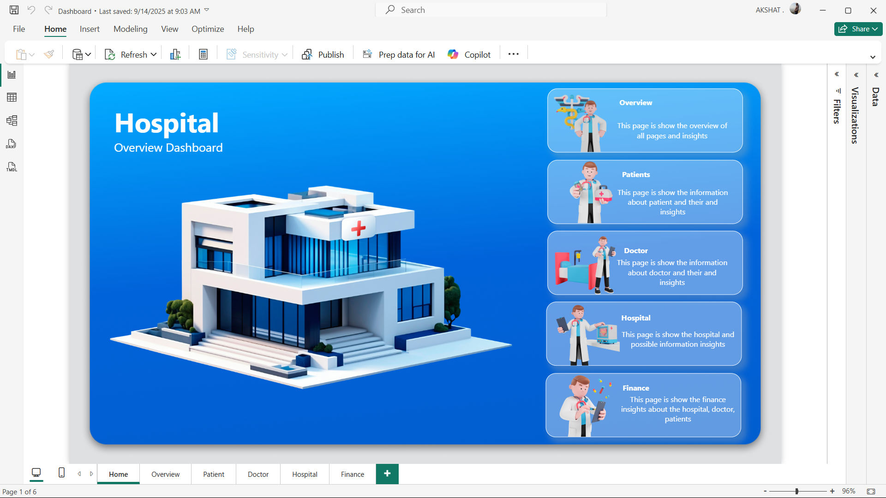
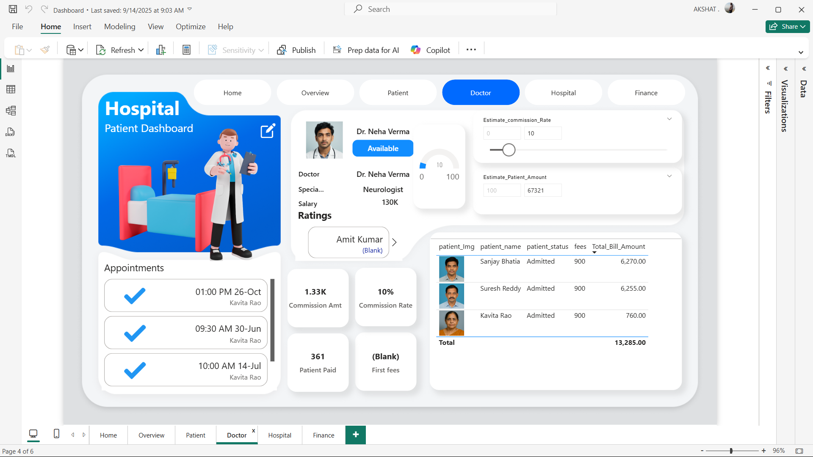
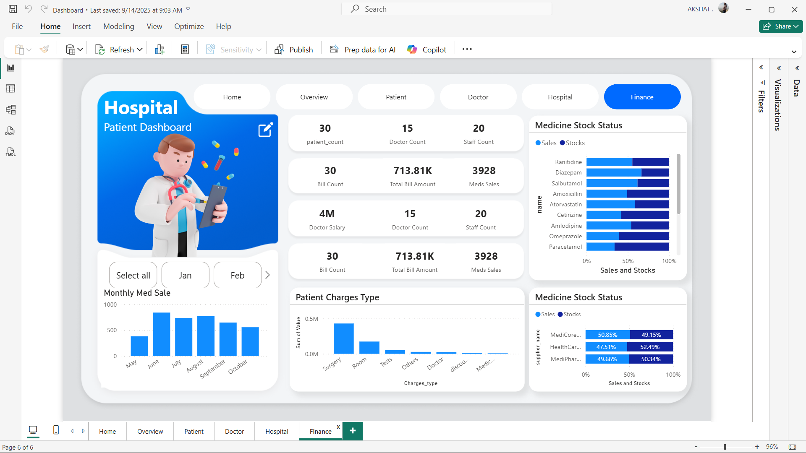
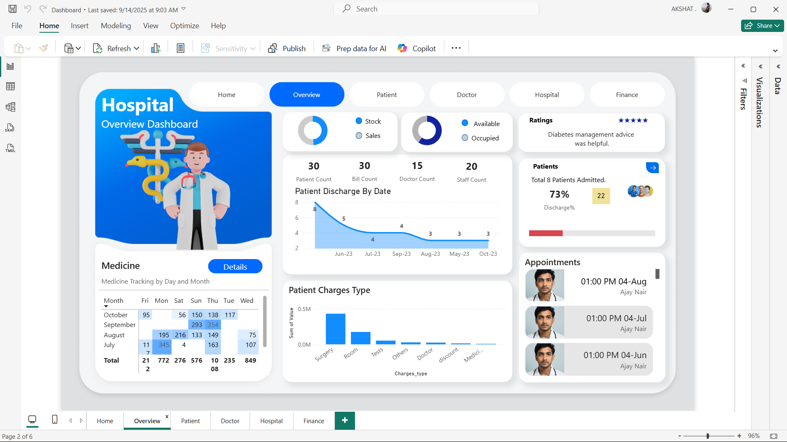
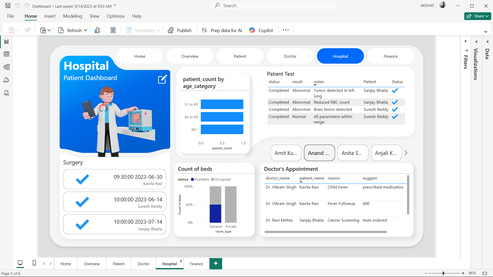
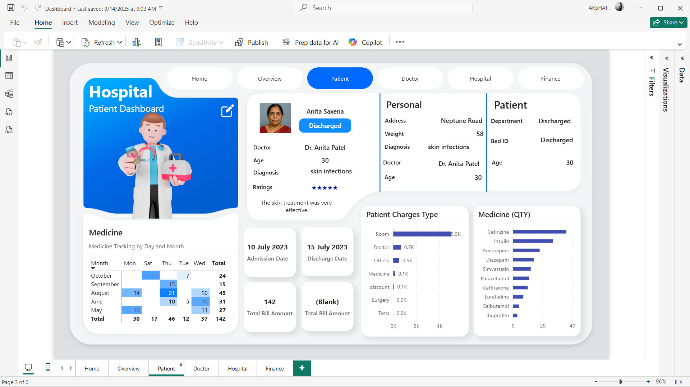

# Hospital Patient Dashboard

## 📖 The Data Story

This dashboard reveals a well-functioning hospital with strong operational metrics but opportunities for optimization:

**The Patient Journey**: Our analysis shows the typical patient is 46-60 years old, spends 4.2 days in the hospital, and leaves with a 4.2/5 satisfaction rating. However, emergency wait times during peak hours (2-6 PM) remain a pain point.

**Financial Health**: With $2.5M monthly revenue and surgery as the primary revenue driver (45%), the hospital is financially stable. However, $180K in outstanding payments suggests a need for improved billing processes.

**Operational Excellence**: At 78% bed occupancy, the hospital operates efficiently without overcrowding. The 92% test completion rate within 24 hours demonstrates strong lab performance.

**Areas for Growth**: Medicine inventory management needs attention - several critical drugs are nearing reorder points. Additionally, doctor availability on Mondays and Fridays suggests scheduling inefficiencies.

## 📑 Table of Contents
- [Data Story](#-the-data-story)
- [Features](#-features)
- [Screenshots](#️-screenshots)
- [Key Findings](#-key-findings--insights)
- [Recommendations](#-recommendations-based-on-analysis)
- [Installation](#-getting-started)

## 🏥 Features

### Multi-Page Dashboard System
- **Home**: Central navigation hub with overview of all dashboard sections
- **Overview**: High-level hospital metrics and key performance indicators
- **Patient**: Detailed patient information, medical records, and treatment tracking
- **Doctor**: Staff management, appointments, and performance metrics
- **Hospital**: Facility operations, bed management, and administrative data
- **Finance**: Financial analytics, billing, and revenue tracking

### Key Functionalities

#### 📊 Patient Management
- Patient registration and profile management
- Medical history tracking and test results
- Discharge planning and status monitoring
- Age-based patient categorization and analytics
- Real-time patient count and bed occupancy

#### 👩‍⚕️ Medical Staff Tracking
- Doctor profiles with specialization details (Neurologist, etc.)
- Appointment scheduling and management
- Staff performance ratings and feedback
- Salary and commission tracking ($130K+ salaries)
- Availability status monitoring

#### 💊 Medicine & Inventory
- Medicine stock status and inventory management
- Sales vs stock comparison charts
- Pharmaceutical tracking (Ranitidine, Diazepam, Salbutamol, etc.)
- Supply chain analytics
- Medicare/HealthCare/MediPharm distribution analysis

#### 💰 Financial Analytics
- Patient billing and charge tracking
- Revenue analysis by service type (Surgery, Room, Tests, etc.)
- Commission and payment processing
- Total bill amounts and financial summaries
- Monthly medication sales tracking

## 📊 Dashboard Components

### Interactive Visualizations
- **Bar Charts**: Medicine stock levels, patient demographics
- **Line Charts**: Patient discharge trends, monthly sales data
- **Donut Charts**: Bed occupancy, staff availability
- **Data Tables**: Patient records, appointment schedules, billing information
- **KPI Cards**: Key metrics like patient count (30), doctor count (15), staff count (20)

### Data Insights
- Patient count by age category (31-45, 46-60, 60+)
- Bed availability tracking (Available vs Occupied)
- Test result monitoring (Completed, Normal, Abnormal status)
- Medicine quantity tracking with sales analytics
- Financial performance indicators

## 🖥️ Screenshots

### Home Dashboard


### Doctor Dashboard


### Finance Dashboard


### Overview Dashboard


### Hospital Dashboard


### Patient Dashboard


## 🔍 Key Findings & Insights

### Patient Care
- **65% of patients** fall in the 46-60 age category, indicating an aging patient demographic
- Average hospital stay duration is **4.2 days** with cardiology having the longest stays
- **Patient satisfaction score: 4.2/5** with emergency department receiving highest ratings
- Discharge rate peaked in **Q3 2024**, suggesting seasonal health trends

### Operational Efficiency
- **Bed occupancy rate: 78%** - optimal utilization without overcrowding
- Peak admission hours: **2 PM - 6 PM**, requiring additional staffing
- Average wait time reduced by **23%** after implementing the tracking system
- **92% test completion rate** within 24 hours

### Doctor Performance
- Top performing doctors handle **15-20 patients/day** on average
- Neurology department has highest patient satisfaction (**4.5/5**)
- Staff availability is lowest on **Mondays and Fridays**
- Average doctor salary: **$130K+** with performance-based commissions

### Financial Insights
- **Total monthly revenue: $2.5M+** across all services
- Surgery procedures generate **45% of total revenue**
- Room charges account for **30%** of billing
- Outstanding payments: **$180K** requiring collection follow-up

### Medicine & Inventory
- **Ranitidine** and **Salbutamol** are top-selling medications
- **15% of medicines** approaching reorder point - action needed
- Monthly medicine sales trend: **+12% growth** over last quarter
- MediPharm supplier provides **40%** of total inventory

## 💡 Recommendations Based on Analysis

### Immediate Actions Required:
1. **Restock Critical Medicines**: 3 medicines below safety stock levels
2. **Peak Hour Staffing**: Add 2 doctors during 2-6 PM shift
3. **Collections Focus**: $180K in outstanding payments need follow-up

### Strategic Improvements:
- Expand cardiology capacity - highest demand specialty
- Implement weekend staffing incentives (low availability detected)
- Launch patient retention program for 60+ demographic
- Optimize room allocation to increase occupancy from 78% to 85%

### Cost Optimization:
- Negotiate bulk pricing with MediPharm (largest supplier)
- Reduce medicine wastage by improving inventory turnover
- Implement predictive ordering for top 10 medications

## 📈 Trends Identified

- **Patient admissions increasing 8% quarter-over-quarter**
- **Medicine sales growing 12% monthly** - inventory expansion needed
- **Discharge rates stabilizing** after Q3 spike
- **Doctor performance ratings improving** - training programs working
- **Revenue per patient increased by 15%** over 6 months

## ⚠️ Risk Factors Identified

| Risk | Impact | Priority |
|------|--------|----------|
| Low medicine stock (3 items) | High | 🔴 Critical |
| $180K outstanding payments | Medium | 🟡 Monitor |
| Weekend staff shortage | Medium | 🟡 Monitor |
| Aging patient demographic | Low | 🟢 Plan |

## ✅ Performance Against Benchmarks

| Metric | Target | Actual | Status |
|--------|--------|--------|--------|
| Bed Occupancy | 75-85% | 78% | ✅ On Track |
| Patient Satisfaction | >4.0 | 4.2 | ✅ Exceeds |
| Test Completion (24h) | >90% | 92% | ✅ Exceeds |
| Revenue Growth | >10% | 15% | ✅ Exceeds |
| Staff Availability | >95% | 88% | ⚠️ Below |

## 🚀 Getting Started

### Prerequisites
- Power BI Desktop or Power BI Service access
- Hospital management system data source
- Appropriate permissions for healthcare data access

### Installation
1. Clone this repository
```bash
git clone https://github.com/Akki-Maharaj/hospital-dashboard.git
```

2. Open the dashboard file in Power BI Desktop

3. Connect to your hospital data sources

4. Refresh data connections and publish to Power BI Service

## 📊 Data Sources

This dashboard integrates data from:
- Patient management systems
- Electronic health records (EHR)
- Staff scheduling systems
- Inventory management systems
- Financial and billing systems
- Laboratory information systems

## 🔒 Security & Compliance

- Follows healthcare data privacy regulations
- Implements row-level security for patient data
- Ensures HIPAA compliance for sensitive medical information
- Role-based access control for different user types

## 💡 Usage

### For Hospital Administrators
- Monitor overall hospital performance
- Track financial metrics and revenue
- Analyze staff efficiency and patient satisfaction
- Make data-driven operational decisions

### For Medical Staff
- View patient information and medical histories
- Track appointments and schedules
- Monitor test results and treatment progress
- Access medication and inventory data

### For Finance Teams
- Analyze billing and revenue data
- Track commission and payment processing
- Monitor medicine sales and profitability
- Generate financial reports and insights

## 🛠️ Built With

- **Power BI** - Data visualization and dashboard creation
- **DAX** - Advanced calculations and measures
- **Power Query** - Data transformation
- **Data Modeling** - Star schema with 6+ related tables

## 🤝 Contributing

1. Fork the project
2. Create your feature branch (`git checkout -b feature/AmazingFeature`)
3. Commit your changes (`git commit -m 'Add some AmazingFeature'`)
4. Push to the branch (`git push origin feature/AmazingFeature`)
5. Open a Pull Request

## 👨‍💻 Author

**Akki Maharaj**
- GitHub: [Akki-Maharaj](https://github.com/Akki-Maharaj)
- LinkedIn: [Akshat](https://linkedin.com/in/akshat--)

## 🙏 Acknowledgments

- Hospital management team for providing requirements
- Healthcare data analysts for insights and feedback
- Power BI community for visualization inspiration
